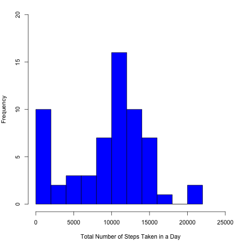
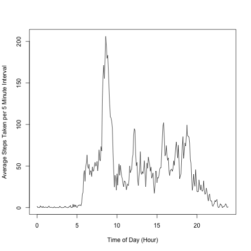
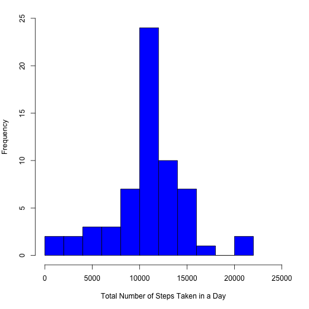
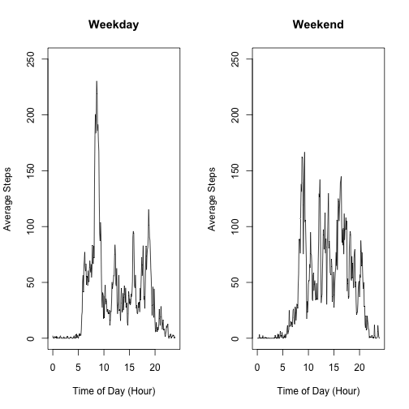

# Reproducible Research Project 1

## Loading and preprocessing the data

#### 1. Load the data


```r
df = read.csv("activity.csv")
dforiginal = df
```

#### 2. Process the data into a format suitable for the analysis.

Make a new column where I convert the original date characters in the data frame to date type.


```r
df$datetype = strptime(df$date, "%Y-%m-%d")
```

Make a new column where the original interval value is converted to consecutive multiples of 5 so that the numbers go from 0 to 1435, which corresponds to 00:00 to 23:55. The function determines the value of the input modulo 288, which corresponds to 60*24/5, which is the total number of 5 minute intervals in a day, then multiplies it by 5 to get the time in minutes. For example, this then creates a new column where the original interval value of 100 corresponds to the new value of 60.


```r
intervalnorm = function(x) {
  5*(x%%288)
}
rowvec = 0:(nrow(df) - 1)
df$intervalnorm = sapply(rowvec, intervalnorm)
```

## What is the mean total number of steps taken per day?

#### 1. Calculate the total number of steps taken per day.

We ignore NAs.


```r
stepsum = tapply(df$steps, df$date, sum, na.rm = TRUE)
stepsum
```

```
## 2012-10-01 2012-10-02 2012-10-03 2012-10-04 2012-10-05 2012-10-06 
##          0        126      11352      12116      13294      15420 
## 2012-10-07 2012-10-08 2012-10-09 2012-10-10 2012-10-11 2012-10-12 
##      11015          0      12811       9900      10304      17382 
## 2012-10-13 2012-10-14 2012-10-15 2012-10-16 2012-10-17 2012-10-18 
##      12426      15098      10139      15084      13452      10056 
## 2012-10-19 2012-10-20 2012-10-21 2012-10-22 2012-10-23 2012-10-24 
##      11829      10395       8821      13460       8918       8355 
## 2012-10-25 2012-10-26 2012-10-27 2012-10-28 2012-10-29 2012-10-30 
##       2492       6778      10119      11458       5018       9819 
## 2012-10-31 2012-11-01 2012-11-02 2012-11-03 2012-11-04 2012-11-05 
##      15414          0      10600      10571          0      10439 
## 2012-11-06 2012-11-07 2012-11-08 2012-11-09 2012-11-10 2012-11-11 
##       8334      12883       3219          0          0      12608 
## 2012-11-12 2012-11-13 2012-11-14 2012-11-15 2012-11-16 2012-11-17 
##      10765       7336          0         41       5441      14339 
## 2012-11-18 2012-11-19 2012-11-20 2012-11-21 2012-11-22 2012-11-23 
##      15110       8841       4472      12787      20427      21194 
## 2012-11-24 2012-11-25 2012-11-26 2012-11-27 2012-11-28 2012-11-29 
##      14478      11834      11162      13646      10183       7047 
## 2012-11-30 
##          0
```

#### 2. Histogram of the total number of steps taken each day.


```r
par(mar=c(5.0,4.0,1.0,2.0))
hist(stepsum,
     breaks = 10,
     main = NULL,
     xlab = "Total Number of Steps Taken in a Day", 
     col = "blue",
     xlim = c(0, 25000),
     ylim = c(0, 20))
```



#### 3. Calculate the mean and median of the total number of steps taken per day.

The mean number of steps over all days can be found as below and is found to be **9354** steps per day.


```r
mean(stepsum)
```

```
## [1] 9354.23
```

The median number of steps over all days can be found as below and is found to be **10395** steps per day.


```r
median(stepsum)
```

```
## [1] 10395
```

## What is the average daily activity pattern?

#### 1. Make a time series plot of the 5-minute interval and the average number of steps taken, averaged across all days

First I calculate the average steps taken per day by interval. Then I plot the time series.


```r
stepavg = tapply(df$steps, df$intervalnorm, mean, na.rm = TRUE)
plot(unique(df$intervalnorm)/60, stepavg,
     type = "l",
     xlab = "Time of Day (Hour)",
     ylab = "Average Steps Taken per 5 Minute Interval")
```



#### 2. Which 5-minute interval, on average across all the days in the dataset, contains the maximum number of steps?

First, I determine what the maximum number of steps on average is. Then I figure out in which time interval this occured by using the which.max function. Then I multiply that by 5, and take the value modulo 60, which gives me the minutes of the interval, and integer division by 60, which gives me the hour of the interval.


```r
max(stepavg)
```

```
## [1] 206.1698
```

```r
maxint5 = (which.max(stepavg)[[1]] - 1)*5
maxint5%/%60
```

```
## [1] 8
```

```r
maxint5%%60
```

```
## [1] 35
```

The time interval **08:35** contains the maximum average number of steps of 206.17.

## Imputing missing values

#### 1. Calculate and report the total number of missing values in the dataset (i.e., the total number of rows with NAs).

The total number of rows with NA can be found by using the complete.cases function as follows.


```r
nrow(df) - sum(complete.cases(dforiginal))
```

```
## [1] 2304
```

This gives us **2304** number of rows with NA.

#### 2. Devise a strategy for filling in all of the missing values in the dataset.

I will fill in the missing values in the data set by using the average value over all days in that time interval.

#### 3. Create a new dataset that is equal to the original dataset but with the missing data filled in.


```r
stepavg2 = aggregate(list(df$steps), list(df$intervalnorm), mean, na.rm = TRUE)
names(stepavg2) = c("interval","avgstep")
df2 = df
rowvec = 0*(1:nrow(df2))
for (i in 1:nrow(df2)) {
  if (is.na(df2$steps[i])) {
    df2$steps[i] = stepavg2$avgstep[df2$intervalnorm[i]/5 + 1]
  }
}
```

#### 4. Make a histogram of the total number of steps taken each day and calculate and report the mean and median total number of steps taken per day.


```r
stepsum2 = tapply(df2$steps, df2$date, sum, na.rm = TRUE)
par(mar=c(5.0,4.0,1.0,2.0))
hist(stepsum2,
     breaks = 10,
     main = NULL,
     xlab = "Total Number of Steps Taken in a Day", 
     col = "blue",
     xlim = c(0, 25000),
     ylim = c(0, 25))
```




The mean number of steps over all days can be found as below and is found to be **10766** steps per day.


```r
mean(stepsum2)
```

```
## [1] 10766.19
```

The median number of steps over all days can be found as below and is found to be **10766** steps per day.


```r
median(stepsum2)
```

```
## [1] 10766.19
```

Imputing missing values increases both the mean and the median from the case of leaving values as NA.

## Are there differences in activity patterns between weekdays and weekends?

#### 1. Create a new factor variable in the dataset with two levels - "weekday" and "weekend" indicating whether a given date is a weekday or weekend day.


```r
weekvar = weekdays(df2$datetype)
df2$week = weekvar

weekdayend = function(x) {
  if (x == "Saturday" | x == "Sunday") {
    y = "weekend"
  }
  else {
    y = "weekday"
  }
  y
}

weekdayendvar = sapply(weekvar, weekdayend)
weekdayendvar2 = factor(weekdayendvar)

df2$weekday = weekdayendvar2
summary(df2$weekday)
```

```
## weekday weekend 
##   12960    4608
```

#### 2. Make a panel plot containing a time series plot of the 5-minute interval (x-axis) and the average number of steps taken, averaged across all weekday days or weekend days (y-axis).


```r
df2day = subset(df2, weekday == "weekday")
df2end = subset(df2, weekday == "weekend")

stepavgday = aggregate(list(df2day$steps), list(df2day$intervalnorm), mean, na.rm = TRUE)
names(stepavgday) = c("interval","avgstep")
stepavgend = aggregate(list(df2end$steps), list(df2end$intervalnorm), mean, na.rm = TRUE)
names(stepavgend) = c("interval","avgstep")

par(mfcol = c(1, 2))
plot(unique(df2$intervalnorm)/60, stepavgday$avgstep,
     type = "l",
     xlab = "Time of Day (Hour)",
     ylab = "Average Steps",
     ylim = c(0, 250),
     main = "Weekday")

plot(unique(df2$intervalnorm)/60, stepavgend$avgstep,
     type = "l",
     xlab = "Time of Day (Hour)",
     ylab = "Average Steps",
     ylim = c(0, 250),
     main = "Weekend")
```



There are more steps taken in the morning on weekdays than weekends. There are more steps in the afternoon and more evenly distributed on weekends.
